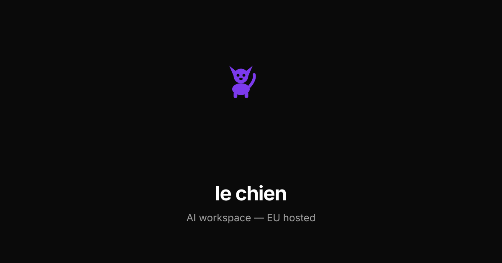
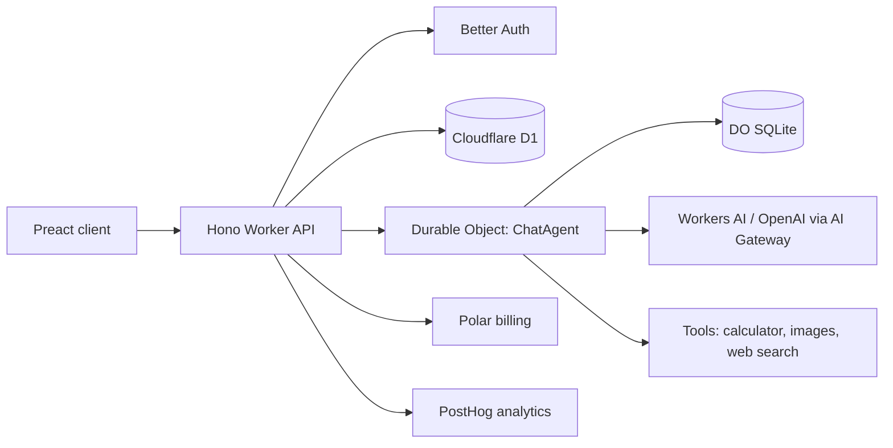

# le chien

An open-model AI chat workspace built on Cloudflare — streaming chat, per-user conversation storage, authentication, and billing, all in a single Worker.



## Tech Stack

| Layer      | Technology                                          |
| ---------- | --------------------------------------------------- |
| Frontend   | Preact + Vite + Tailwind CSS (signals-based state)  |
| Backend    | Hono on Cloudflare Workers                          |
| Chat state | Durable Objects (one agent per user)                |
| Database   | Drizzle ORM + Cloudflare D1 (SQLite)                |
| Auth       | Better Auth (email/password)                        |
| Billing    | Polar (free/pro plans, webhooks)                    |
| Models     | Workers AI (default) + OpenAI via AI Gateway        |
| Analytics  | PostHog (optional)                                  |

## Project Structure

```
├── web/                   Single Cloudflare Worker (frontend + API)
│   ├── src/               Preact frontend (Vite)
│   │   ├── components/    UI components
│   │   ├── pages/         Route pages (Landing, Auth, Chat, Billing)
│   │   ├── models/        Signal-based models
│   │   └── lib/           Auth client, API client, shortcuts
│   ├── server/            Hono backend
│   │   ├── agents/        Durable Object (ChatAgent)
│   │   ├── db/            Drizzle schema
│   │   ├── lib/           Auth, models, plans, tools
│   │   ├── routes/        API routes
│   │   └── utils/         Helpers
│   ├── drizzle/           D1 migrations
│   └── wrangler.example.jsonc Example Worker config
├── docs/                  Internal design & architecture notes
└── package.json           Workspace scripts (lint, format)
```

## Architecture



See [docs/architecture.md](./docs/architecture.md) for more detail.

## Quick Start

```sh
./setup.sh
```

This copies the example env and Worker config files, installs dependencies, and runs local D1 migrations. Then follow the steps below to fill in your keys.

## Getting Started

### Prerequisites

- Node.js 20+
- pnpm
- A [Cloudflare](https://dash.cloudflare.com) account (free tier works)
- A [Polar](https://polar.sh) account (for billing)

### 1. Install dependencies

```sh
pnpm install
```

### 2. Set up local configuration

Copy the examples:

```sh
cp web/.dev.vars.example web/.dev.vars
cp web/wrangler.example.jsonc web/wrangler.jsonc
```

Both generated files are gitignored. Keep real account IDs, database IDs, product IDs, and secrets out of commits.

| Variable               | Description                                                                                                |
| ---------------------- | ---------------------------------------------------------------------------------------------------------- |
| `BETTER_AUTH_SECRET`   | Any random string — used to sign session tokens. Generate one with `openssl rand -hex 32`.                 |
| `BILLING_ENABLED`      | Set to `"true"` to enable Polar billing and rate limits. Leave unset for self-hosted (everyone Pro).       |
| `POLAR_ACCESS_TOKEN`   | Required when `BILLING_ENABLED=true`. Your Polar API access token (see Polar setup below).                 |
| `POLAR_WEBHOOK_SECRET` | Required when `BILLING_ENABLED=true`. Webhook signing secret from Polar.                                   |
| `POLAR_PRO_PRODUCT_ID` | Required when `BILLING_ENABLED=true`. The Polar product ID for your "Pro" plan.                            |
| `OPENAI_API_KEY`       | OpenAI key (only needed if you expose OpenAI-routed models).                                               |
| `CF_ACCOUNT_ID`        | Your Cloudflare account ID (needed for AI Gateway routing).                                                |
| `CF_API_TOKEN`         | Cloudflare API token (for AI Gateway).                                                                     |
| `POSTHOG_API_KEY`      | Optional. Enables server-side event tracking.                                                              |
| `TAVILY_API_KEY`       | Optional. Enables the `web_search` tool.                                                                   |

`APP_URL`, `BETTER_AUTH_URL`, `LOCAL`, `CF_ACCOUNT_ID`, `CF_AI_GATEWAY_ID`, `POLAR_PRO_PRODUCT_ID`, and D1 `database_id` live in your local `web/wrangler.jsonc`. Replace placeholders before deploying.

### 3. Set up Polar (billing)

1. Go to [polar.sh](https://polar.sh) and create an account.
2. Create an **Organization**.
3. Create a **Product** for your Pro plan and copy its **Product ID** — this is your `POLAR_PRO_PRODUCT_ID`.
4. **Settings → Developers → Personal Access Tokens** — create a token, copy it as `POLAR_ACCESS_TOKEN`.
5. **Settings → Webhooks → Add Endpoint**:
   - URL: `https://<your-domain>/api/auth/polar/webhook` (for local dev, see [Polar's local webhook guide](https://docs.polar.sh/integrate/webhooks/locally)).
   - Events: `subscription.updated`, `subscription.active`, `subscription.canceled`, `subscription.revoked`, `customer.created`.
   - Copy the **Signing Secret** as `POLAR_WEBHOOK_SECRET`.

When `LOCAL=true`, Polar runs in sandbox mode — no real payments.

### 4. Set up the database

```sh
cd web
pnpm run db:generate
pnpm run db:migrate:local
```

### 5. Run locally

```sh
cd web && pnpm dev
```

Open [http://localhost:5173](http://localhost:5173).

## Deployment

See [docs/deployment.md](./docs/deployment.md) for the full Cloudflare, D1, Polar, secrets, verification, and rollback flow.

```sh
cd web && pnpm run deploy
```

The Worker serves both the API and the built frontend assets.

## Lint & Format

```sh
pnpm -w run lint         # oxlint with auto-fix
pnpm -w run format       # oxfmt write
pnpm -w run check        # lint + format check (CI)
```

`pnpm install` also installs a shared `pre-commit` hook that runs `lint-staged` on changed files.

## Contributing

See [CONTRIBUTING.md](./CONTRIBUTING.md).

## License

MIT — see [LICENSE](./LICENSE).
