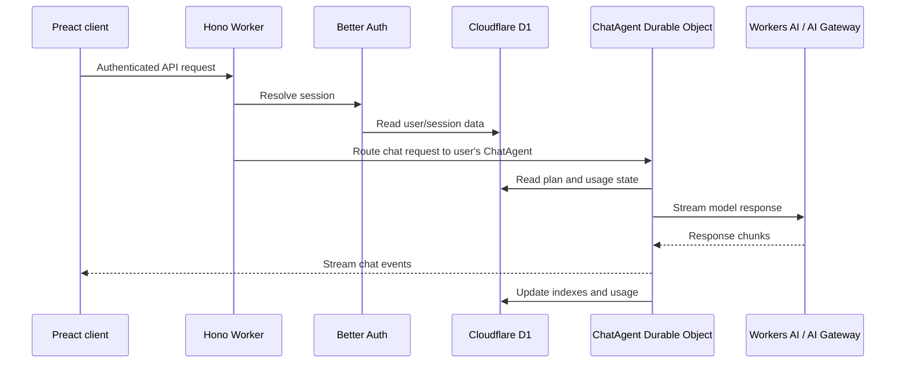

# Architecture

le chien is a single Cloudflare Worker application: the Worker serves the Preact frontend, handles API routes, owns authentication and billing integration, and coordinates per-user chat state through Durable Objects.

## Request flow

## Main pieces

- `web/src/`: Preact app, UI components, signal models, and client helpers.
- `web/server/`: Hono API routes, Better Auth setup, billing helpers, model routing, and tools.
- `web/server/agents/chat-agent.ts`: Durable Object that owns per-user conversations, chat streaming, tool execution, and pet state.
- `web/drizzle/`: D1 migrations and Drizzle metadata.
- `web/src/runtime/`: sandboxed artifact runtime for rendering generated Preact snippets safely.

## State model

- Durable Object SQLite stores the source-of-truth conversation state for each user's chat agent.
- Cloudflare D1 stores shared relational state: users, sessions, subscriptions, usage counters, and conversation indexes.
- Secrets live outside the repository in `web/.dev.vars` for local development and `wrangler secret` for production.
